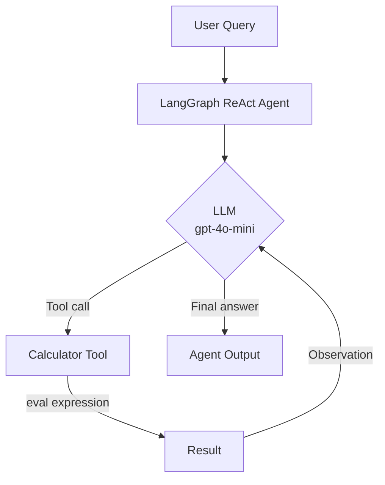
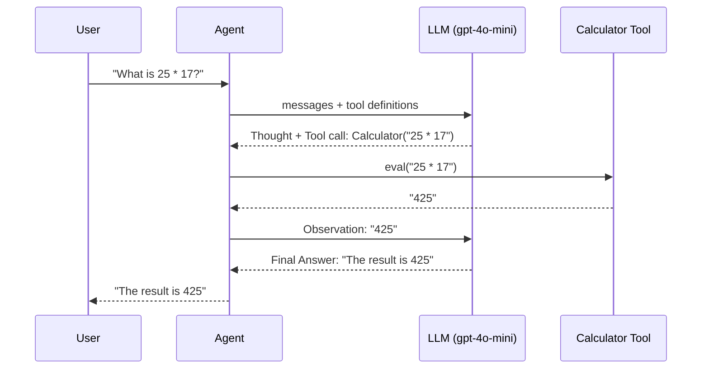
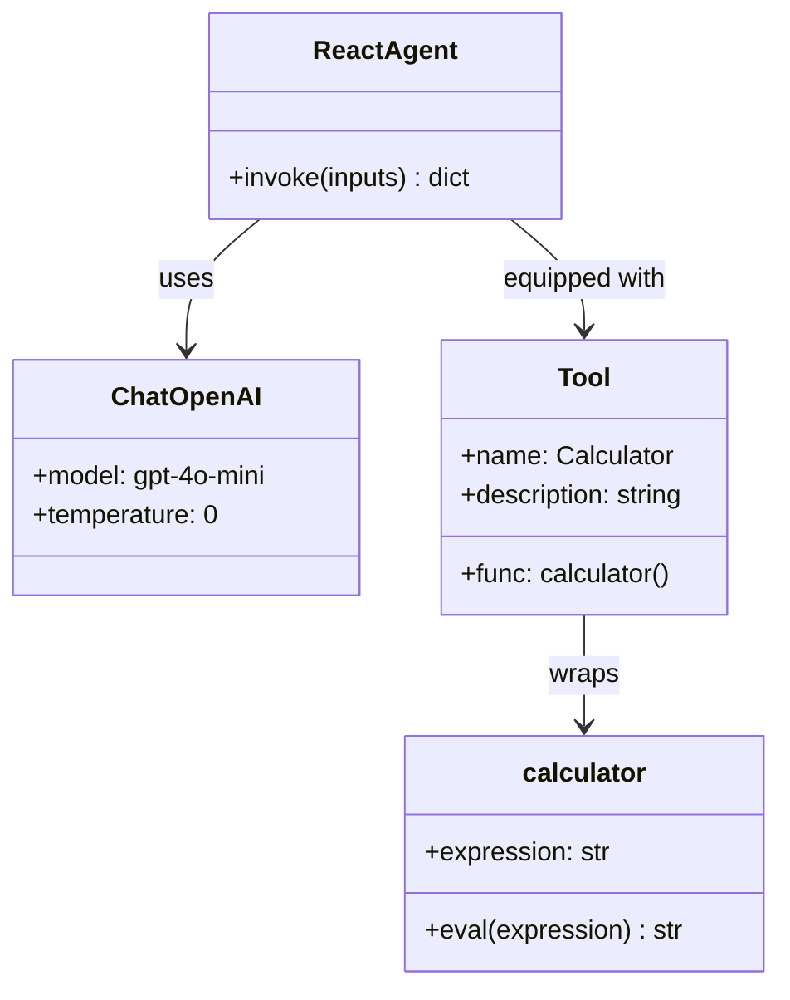
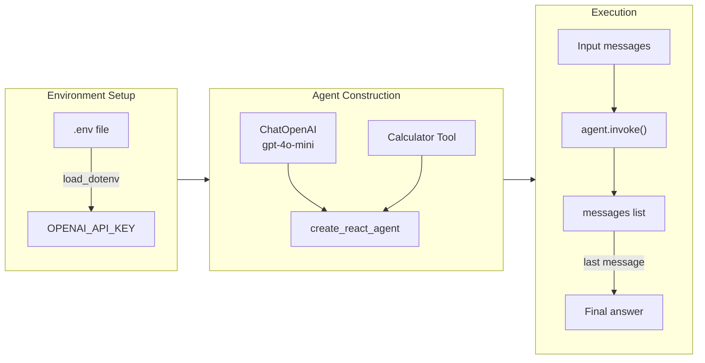

# Lab 01 — Math Agent

A minimal ReAct agent that uses a `Calculator` tool to evaluate mathematical expressions, built with LangChain 1.x and LangGraph.

---

## Architecture



---

## ReAct Loop



---

## Component Overview



---

## Setup

### Prerequisites

- Python 3.9+
- An OpenAI API key

### Install dependencies

```bash
pip install python-dotenv langchain langchain-openai langgraph langchain-core \
  "protobuf>=5.28.0,<7.0.0" "dataclasses-json>=0.6.7,<0.7.0"
```

### Configure environment

Create a `.env` file in the project root:

```
OPENAI_API_KEY=sk-...
```

---

## How It Works



1. **Load environment** — `load_dotenv(override=True)` reads `OPENAI_API_KEY` from `.env`.
2. **Define the tool** — `calculator()` wraps Python's `eval` with restricted builtins for basic safety.
3. **Create the agent** — `create_react_agent(llm, tools)` wires the LLM and tools into a LangGraph state machine.
4. **Invoke** — Pass `{"messages": [("user", "...")]}` and read `result["messages"][-1].content`.

---

## Security Note

The `calculator` function restricts `eval` by passing `{"__builtins__": None}` as the globals dict, preventing access to built-in Python functions. Only mathematical operators are evaluated.

---

## Dependencies

| Package | Purpose |
|---|---|
| `langchain-openai` | OpenAI LLM integration |
| `langgraph` | ReAct agent state machine |
| `langchain-core` | `Tool` abstraction |
| `python-dotenv` | Load `.env` variables |
