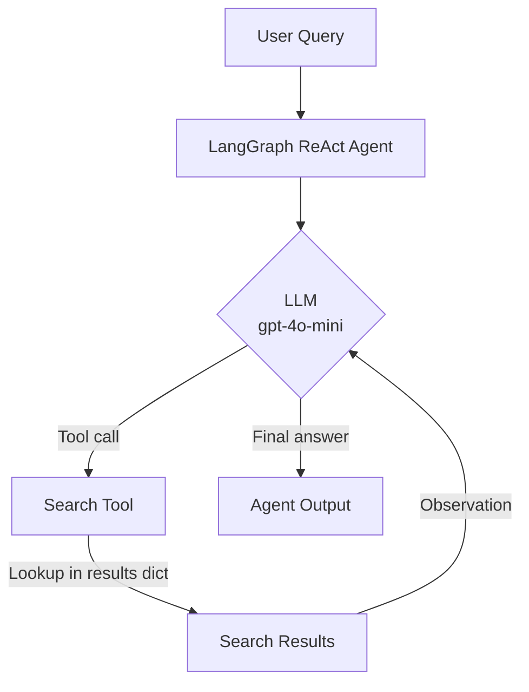
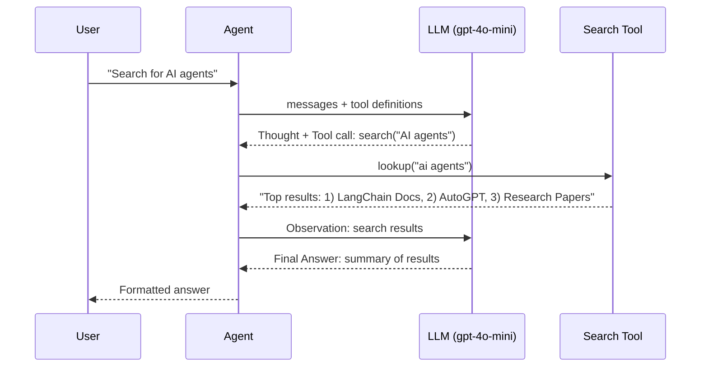
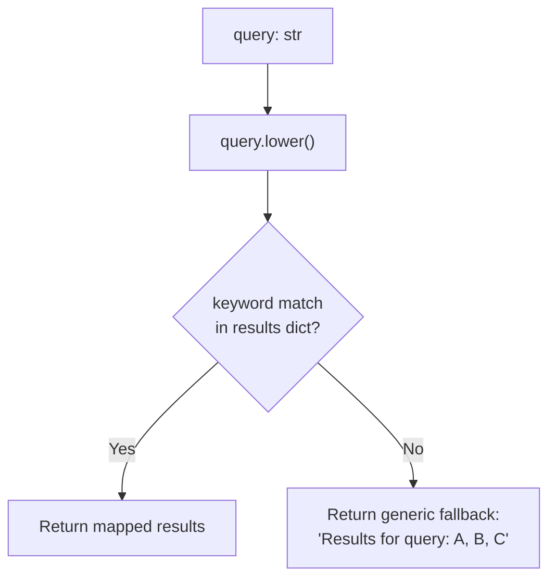
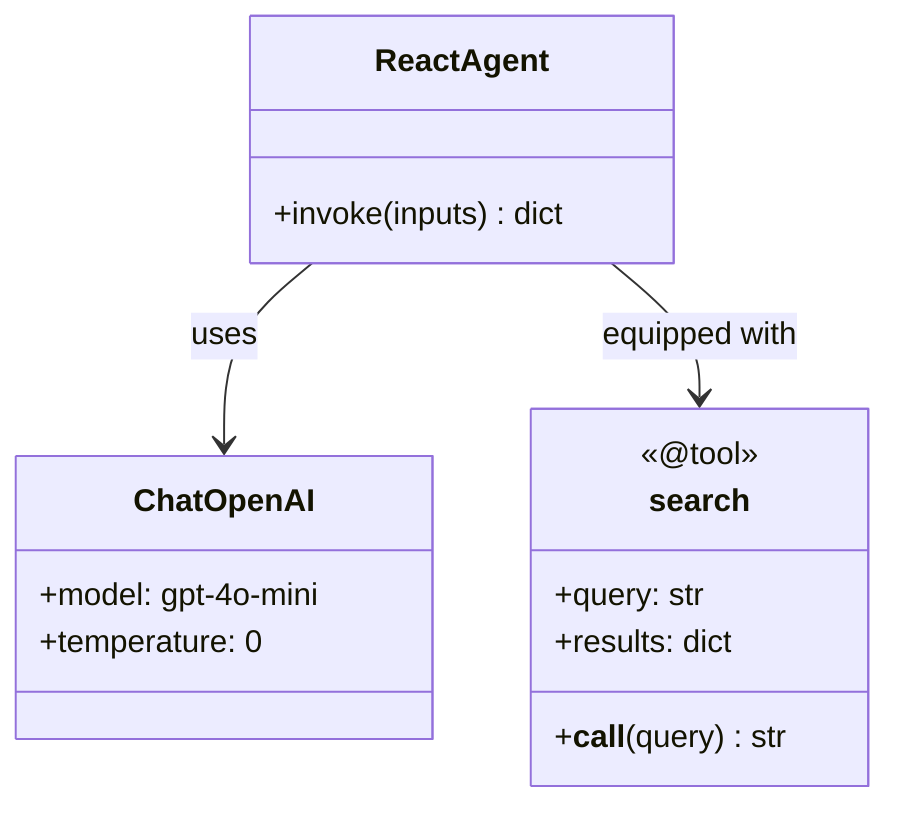
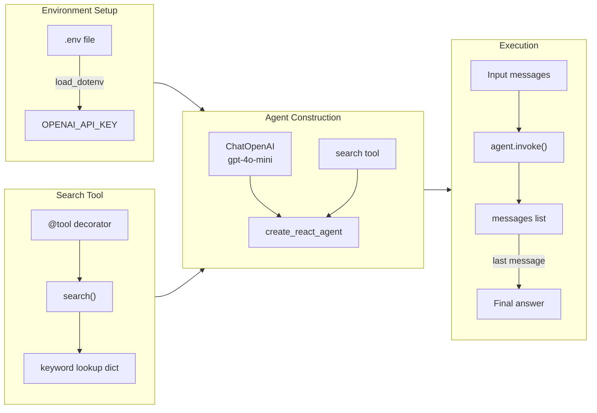
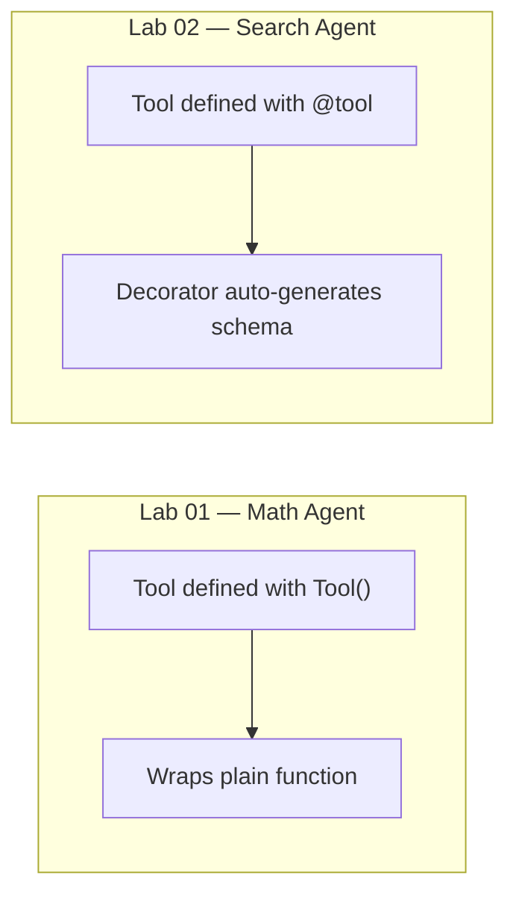

# Lab 02 — Search Agent

A minimal ReAct agent that uses a `search` tool backed by a fake in-memory knowledge base, built with LangChain 1.x and LangGraph.

---

## Architecture



---

## ReAct Loop



---

## Search Tool Logic



---

## Component Overview



---

## Setup

### Prerequisites

- Python 3.9+
- An OpenAI API key

### Install dependencies

```bash
pip install python-dotenv langchain langchain-openai langgraph langchain-core
```

### Configure environment

Create a `.env` file in the project root:

```
OPENAI_API_KEY=sk-...
```

---

## How It Works



1. **Load environment** — `load_dotenv(override=True)` reads `OPENAI_API_KEY` from `.env`.
2. **Define the tool** — The `@tool` decorator turns `search()` into a LangChain tool. It checks a hardcoded dict for known keywords (`ai agents`, `python`, `machine learning`) and falls back to a generic response.
3. **Create the agent** — `create_react_agent(llm, tools)` wires the LLM and tools into a LangGraph state machine.
4. **Invoke** — Pass `{"messages": [{"role": "user", "content": "..."}]}` and read `result["messages"][-1].content`.

---

## Built-in Knowledge Base

| Keyword | Results returned |
|---|---|
| `ai agents` | LangChain Documentation, AutoGPT Project, AI Agent Research Papers |
| `python` | Python.org, Python Tutorial, Python Package Index |
| `machine learning` | Scikit-learn, TensorFlow, PyTorch |
| *(anything else)* | Generic fallback: Example Result A, B, C |

---

## Key Difference from Lab 01



Lab 02 uses the `@tool` decorator instead of `Tool(...)`, which automatically infers the tool's name, description, and input schema from the function signature and docstring.

---

## Dependencies

| Package | Purpose |
|---|---|
| `langchain-openai` | OpenAI LLM integration |
| `langgraph` | ReAct agent state machine |
| `langchain-core` | `@tool` decorator |
| `python-dotenv` | Load `.env` variables |
