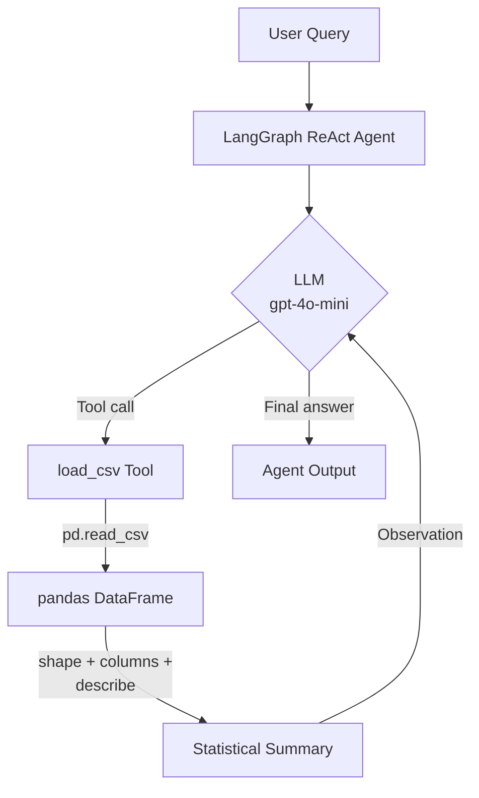
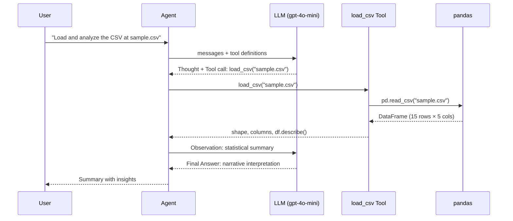
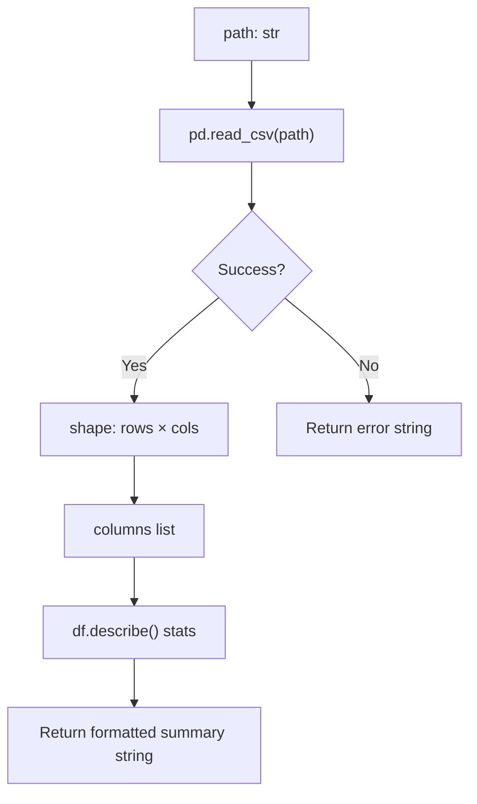
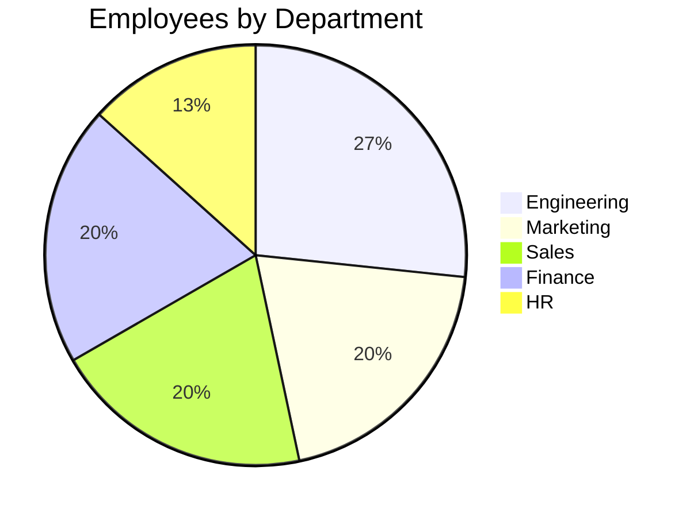
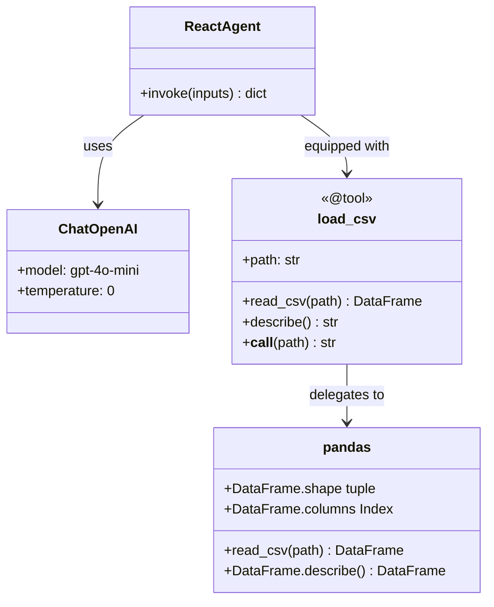
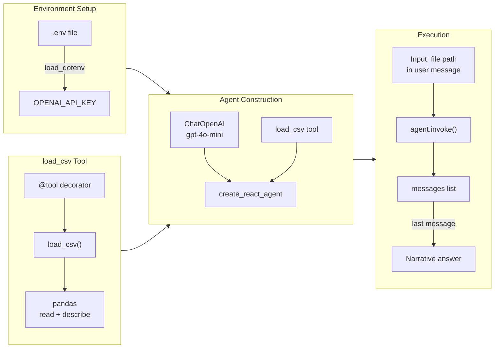
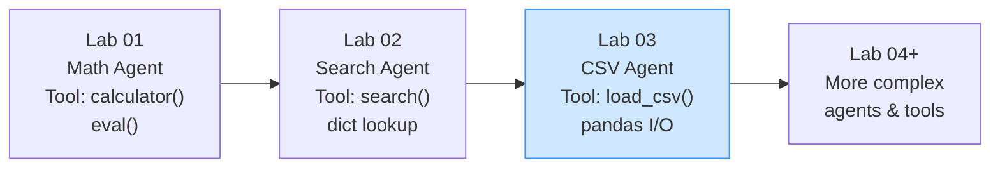

# Lab 03 — CSV Analyzer Agent

A ReAct agent that loads a CSV file and returns a statistical summary using a `load_csv` tool backed by pandas, built with LangChain 1.x and LangGraph.

---

## Architecture



---

## ReAct Loop



---

## Tool Logic



---

## Sample Dataset — `sample.csv`

15 employees across 5 departments.



| Column | Type | Description |
|---|---|---|
| `name` | string | Employee name |
| `age` | int | Age in years |
| `salary` | int | Annual salary (USD) |
| `department` | string | Department name |
| `years_experience` | int | Years of experience |

---

## Component Overview



---

## Setup

### Prerequisites

- Python 3.9+
- An OpenAI API key
- A CSV file accessible from the working directory

### Install dependencies

```bash
pip install python-dotenv langchain langchain-openai langgraph langchain-core pandas
```

### Configure environment

Create a `.env` file in the project root:

```
OPENAI_API_KEY=sk-...
```

---

## How It Works



1. **Load environment** — `load_dotenv(override=True)` reads `OPENAI_API_KEY` from `.env`.
2. **Define the tool** — `load_csv()` uses pandas to read a CSV, returning shape, column names, and `df.describe()` as a formatted string.
3. **Create the agent** — `create_react_agent(llm, tools)` builds the LangGraph state machine.
4. **Invoke** — Pass a natural-language request containing the file path; the agent decides to call the tool and interprets the output.

---

## What `df.describe()` Returns

`df.describe()` generates summary statistics for all numeric columns:

| Statistic | Meaning |
|---|---|
| `count` | Number of non-null values |
| `mean` | Average |
| `std` | Standard deviation |
| `min` / `max` | Range |
| `25%` / `50%` / `75%` | Quartiles |

The LLM then narrates these statistics in plain language.

---

## Progression Across Labs



Each lab adds a more realistic tool while keeping the same `create_react_agent` pattern.

---

## Dependencies

| Package | Purpose |
|---|---|
| `langchain-openai` | OpenAI LLM integration |
| `langgraph` | ReAct agent state machine |
| `langchain` | `@tool` decorator |
| `pandas` | CSV loading and statistical summary |
| `python-dotenv` | Load `.env` variables |
