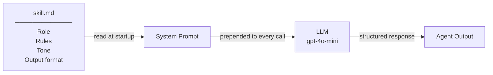
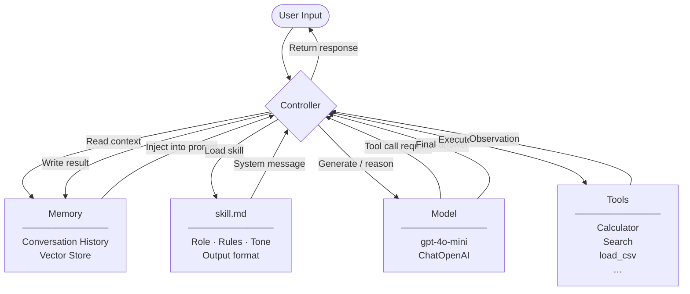
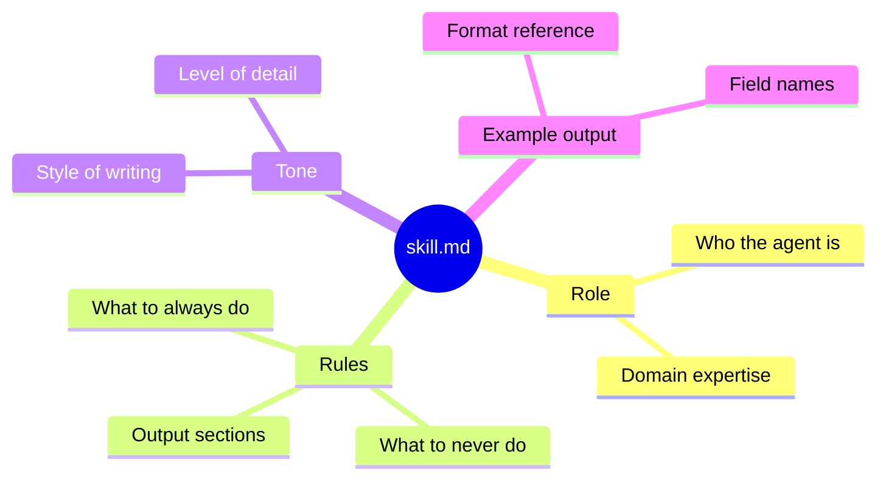
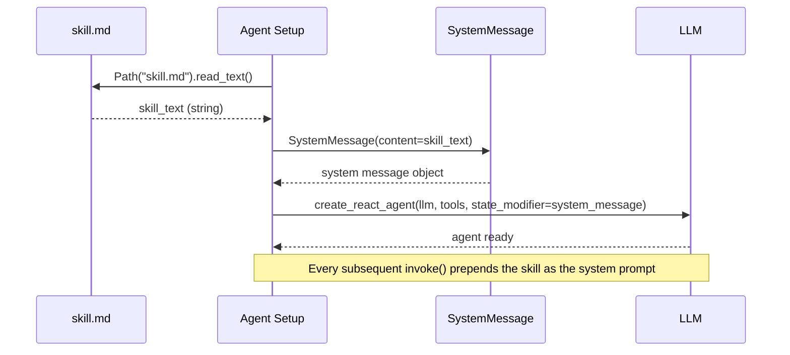
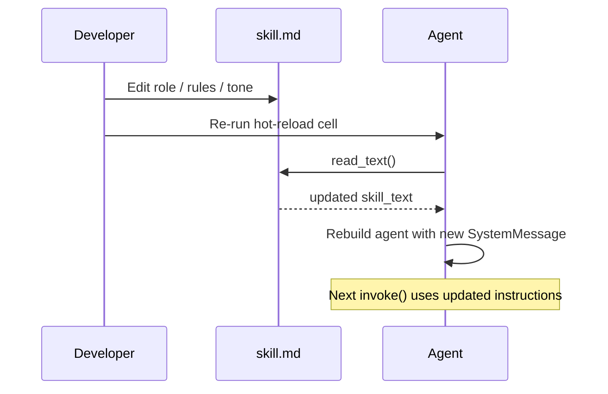
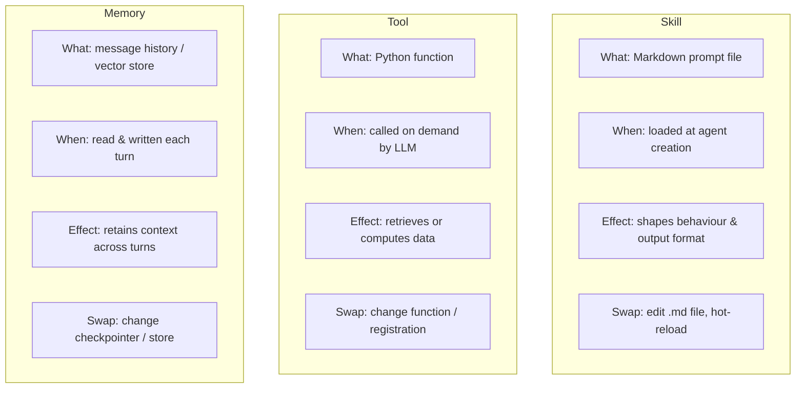
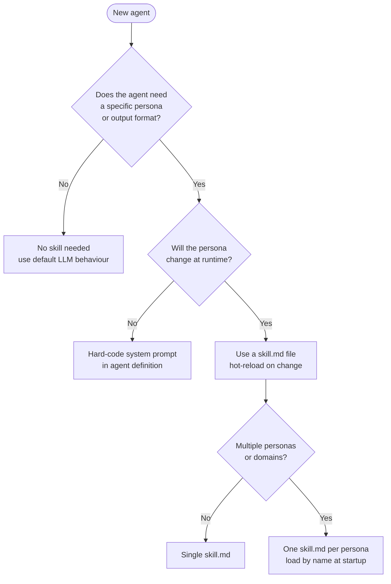
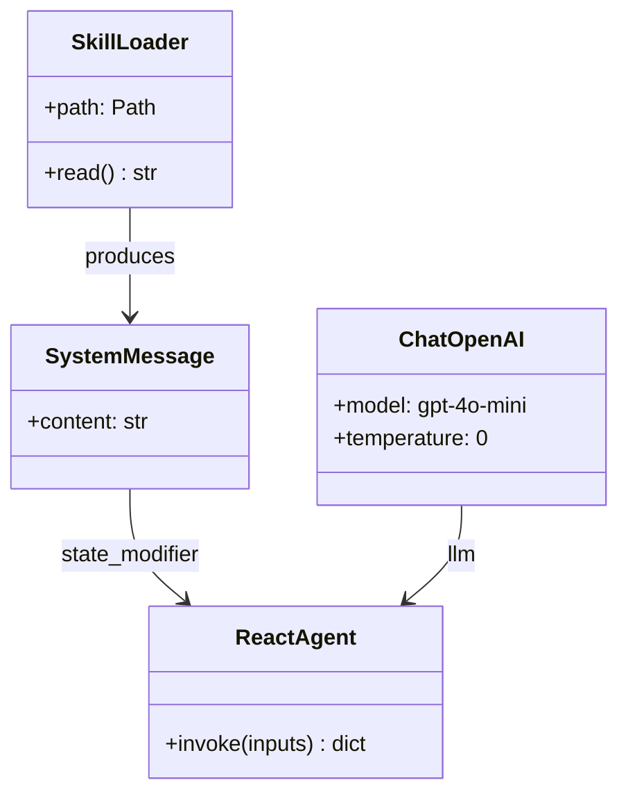

# Agent Skills

A **skill** is a plain-text (Markdown) file that defines an agent's role, rules, and output format. Injecting it as a system prompt gives the LLM a focused persona without changing any Python code.

---

## What Is a Skill?



---

## How It Fits Into the Agent Architecture



---

## Skill File Anatomy



---

## Loading a Skill at Runtime



---

## Hot-Reload Pattern

Edit `skill.md` and re-run — no kernel restart required.



---

## Skill vs. Tool vs. Memory



| | Skill | Tool | Memory |
|---|---|---|---|
| Format | Markdown file | Python function | Message list / vector DB |
| Controls | LLM behaviour & style | Data access & computation | Context across turns |
| Changed by | Editing `.md` | Editing Python | Conversation state |
| Required? | Optional | Optional | Optional |

---

## Decision Tree — When to Use a Skill



---

## Component Overview



---

## Setup

### Prerequisites

- Python 3.9+
- An OpenAI API key

### Install dependencies

```bash
pip install python-dotenv langchain langchain-openai langgraph langchain-core
```

### Configure environment

Create a `.env` file in the project root:

```
OPENAI_API_KEY=sk-...
```

---

## Minimal Example

```python
from pathlib import Path
from langchain_openai import ChatOpenAI
from langchain_core.messages import SystemMessage
from langgraph.prebuilt import create_react_agent

skill_text = Path("skill.md").read_text()

agent = create_react_agent(
    ChatOpenAI(model="gpt-4o-mini", temperature=0),
    tools=[],
    state_modifier=SystemMessage(content=skill_text),
)

result = agent.invoke({"messages": [("user", "Review my code: def f(x): return x/0")]})
print(result["messages"][-1].content)
```

> See **`04_skill_agent.ipynb`** for the full runnable example including hot-reload.

---

## Skill File Template

```markdown
# Skill: <Name>

## Role
<One sentence describing who the agent is and what it does.>

## Rules
- <Always do X>
- <Never do Y>
- Output must contain these sections: …

## Tone
- <Style notes>

## Example output format
\`\`\`
### Section 1
…
### Verdict
…
\`\`\`
```
