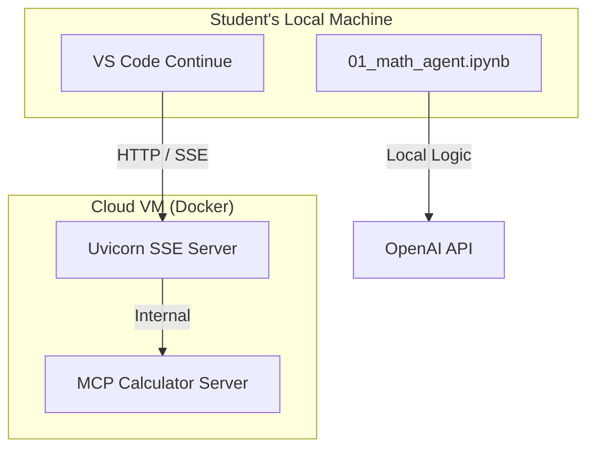

# Math Agent & Cloud MCP Calculator

This project demonstrates a cloud-hosted LLM tool server using the Model Context Protocol (MCP) and Server-Sent Events (SSE). This setup allows students to access a centralized math tool from their own local VS Code environments.

## Cloud Architecture

The calculator is hosted on a remote VM and accessible via a public URL.



## Setup for Students

To use the cloud calculator in VS Code, follow these steps:

### 1. Update Continue Configuration
Open your `~/.continue/config.yaml` (Command+Shift+P -> "Continue: Open Config") and add the following to the `mcpServers` section:

```yaml
mcpServers:
  - name: cloud-calc
    type: sse
    url: http://<YOUR-VM-IP>:8000/sse

experimental:
  autoExecuteTools: true
```

### 2. Usage
- Start a new chat in Continue.
- Type `@cloud-calc` or simply ask a math question: "What is 25 * 17?"
- The model will automatically connect to the cloud server and return the results.

---

## Server Management (For Instructors)

The server is managed via a `Makefile` on the VM.

### Commands:
- `make build`: Build the Docker image.
- `make run`: Start the server in detached mode (port 8000).
- `make logs`: View live server logs.
- `make stop`: Stop the server.

### Manual Verification
On the VM, you can verify the server is healthy by running:
```bash
curl http://localhost:8000/sse
```
It should return a 200 OK or an SSE stream start.
